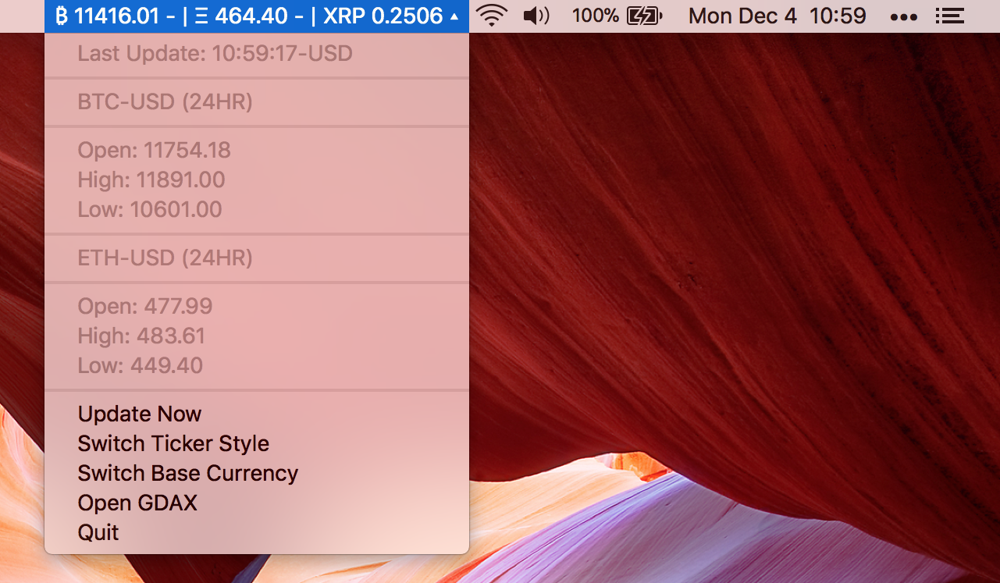

# CrypTick
## A ticker for Bitcoin and Ethereum for the macOS menu bar

## How It Works
The ticker lives in the macOS status bar next to your clock, volume, wifi,
etc. It takes the prices of Bitcoin and Ethereum from the GDAX market
every 30 seconds.

There are two buttons provided in the menu item: one to quit the app,
and one to open GDAX in your default browser.

Enjoy!

## Updates

* Now supporting change from last update
* Ripple prices
* Manual Updating
* Colored Ticker Style
* EUR base currency

## Donating

If you like Cryptick and want to support its development, you can deposit BTC to our tip jar!

`12Kwx85XzbawEiNPuWNgLTZp8TyY4njArE`

CrypTick is, and will always be, open source and free to use.

[Icon Source](http://imgarcade.com/bitcoin-icon.html)
